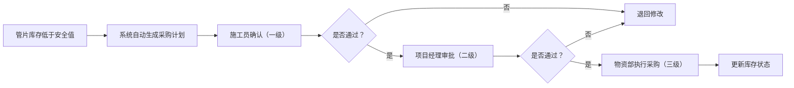
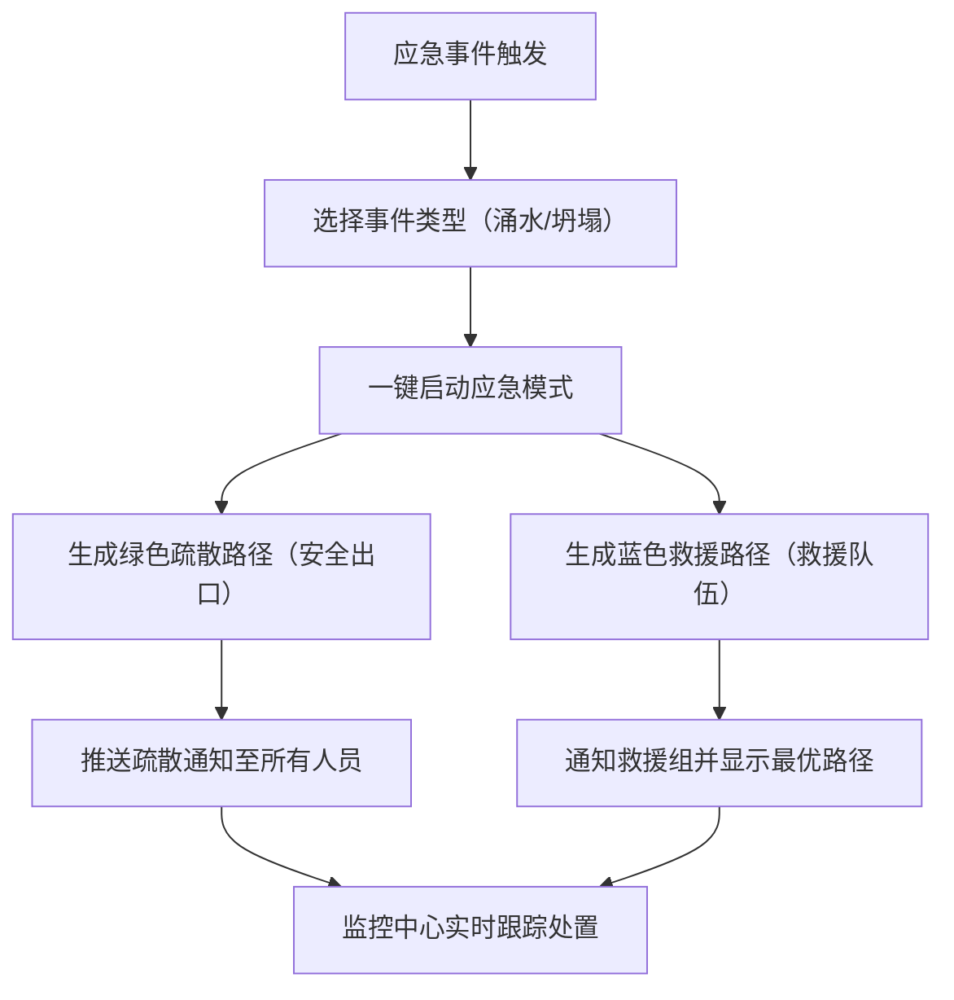

## 1. 产品概述

3D智慧地铁车站与隧道施工综合调度与应急可视化平台，基于WebGL三维渲染技术，实现地铁施工全流程的数字化管控。平台整合盾构掘进监测、地表沉降预警、管片库存管理、人员定位、设备维护、应急调度等核心模块，为施工员、项目经理、公司领导三级用户提供一体化决策支持。

- 核心目标：解决地铁施工过程中多源数据分散、应急响应滞后、进度管控困难等痛点
- 目标用户：地铁施工单位的一线施工员、项目经理、公司管理层
- 产品价值：提升施工安全管控能力、优化资源配置效率、缩短应急响应时间

## 2. 核心功能

### 2.1 用户角色与权限

| 角色 | 登录方式 | 核心权限 |
|------|----------|----------|
| 施工员 | 人脸识别 | 查看施工参数、确认管片采购计划、上传施工日志、响应预警 |
| 项目经理 | 人脸识别 | 审批管片采购计划（二级）、查看全项目数据、下达调度指令、审核保养工单 |
| 公司领导 | 人脸识别 | 多项目总览、决策审批（三级）、导出施工日报、查看统计分析 |

### 2.2 功能模块清单

1. **登录模块**：人脸识别登录界面、操作日志记录
2. **3D主场景**：盾构机模型、车站基坑模型、管片堆场模型、地表监测点、监控中心
3. **盾构监测模块**：实时参数显示、24小时曲线分析、自动参数调整
4. **沉降预警模块**：地表沉降监测、超限区域高亮、自动预警推送
5. **管片管理模块**：库存可视化、低库存预警、三级审批采购流程
6. **人员定位模块**：实时位置显示、密闭舱室超时救援预警
7. **进度管理模块**：车站结构进度自动更新、关键节点延期催办
8. **设备维护模块**：盾构机保养工单自动生成、保养记录
9. **应急调度模块**：一键启动应急、疏散/救援路径生成、事件处置
10. **报表导出模块**：施工日报Excel导出、数据统计

### 2.3 页面详情

| 页面名称 | 模块名称 | 功能描述 |
|----------|----------|----------|
| 登录页 | 人脸识别 | 摄像头采集人脸、角色选择、登录日志记录 |
| 3D主控台 | 场景渲染 | 全景3D场景浏览、模型交互（旋转/缩放/点击）、视角切换 |
| 3D主控台 | 盾构机信息面板 | 编号、推进速度、刀盘扭矩、注浆压力、累计环数显示 |
| 3D主控台 | 参数曲线弹窗 | 点击盾构机弹出24小时施工参数曲线图（多轴对比） |
| 3D主控台 | 沉降监测面板 | 监测点沉降值显示、超限区域红色高亮、预警列表 |
| 3D主控台 | 管片堆场面板 | 管片规格/龄期/库存显示、低库存橙色闪烁、采购计划入口 |
| 3D主控台 | 人员定位面板 | 人员姓名/工种悬浮标签、舱室超时人员红色闪烁预警 |
| 3D主控台 | 车站进度面板 | 进度百分比环形图、关键节点状态、延期催办提示 |
| 管片审批页 | 审批流程 | 采购计划列表、三级审批流转（施工员→项目经理→物资部）、审批意见 |
| 工单管理页 | 保养工单 | 盾构机保养提醒、工单详情、保养确认、保养记录查询 |
| 应急指挥页 | 应急调度 | 事件类型选择（涌水/坍塌）、一键启动、绿色疏散路径、蓝色救援路径 |
| 日报导出页 | 数据导出 | 日期选择、盾构掘进统计、沉降监测记录、全事件统计、Excel下载 |

## 3. 核心流程

### 3.1 主业务流程

用户通过人脸识别登录系统，进入3D主控台全景视图。可点击任意模型对象查看详情：点击盾构机查看参数曲线，点击监测点查看沉降数据，点击管片查看库存。系统后台实时监控数据，自动触发预警（沉降超限→区域变红+推送、低库存→橙色闪烁+采购计划、舱室超时→红色闪烁+救援、超环数→保养工单、进度延期→催办）。应急状态下一键启动路径规划。

### 3.2 审批流程

### 3.3 应急响应流程

## 4. 用户界面设计

### 4.1 设计风格

- **主色调**：深空蓝 (#0A1628) 背景，科技蓝 (#1890FF) 主色，警示红 (#FF4D4F) 预警，安全绿 (#52C41A) 正常，橙色警戒 (#FA8C16)
- **按钮风格**：科技感圆角矩形，带微发光效果，悬浮状态亮度提升
- **字体**：标题使用 Orbitron（科技感），正文使用 PingFang SC / Microsoft YaHei
- **布局风格**：3D场景全屏居中，四周浮动信息面板（左上：导航，右上：预警，左下：盾构参数，右下：进度），半透明玻璃拟态卡片
- **视觉元素**：HUD风格边框、扫描线动效、数据流光、粒子背景

### 4.2 页面设计概览

| 页面名称 | 模块名称 | UI元素与动效 |
|----------|----------|--------------|
| 登录页 | 人脸识别 | 圆形摄像头取景框、人脸扫描线动效、角色选择卡片、发光登录按钮 |
| 3D主控台 | 场景渲染 | 星点粒子背景、模型选中高亮描边、平滑相机动画、场景扫光效果 |
| 3D主控台 | 盾构信息卡 | 数据实时跳动动画、数值超限红色脉冲、进度条渐变填充 |
| 3D主控台 | 参数曲线 | 多色折线图（蓝/绿/橙/紫）、数据点悬浮tooltip、时间轴缩放 |
| 3D主控台 | 预警面板 | 预警条目从右侧滑入、红色闪烁边框、倒计时处置时间 |
| 3D主控台 | 人员标签 | 头顶姓名标签气泡、工种颜色区分、超时红色呼吸灯效果 |
| 审批页 | 流程流转 | 审批节点时间轴、流转箭头动画、已完成节点绿色打钩 |
| 应急指挥页 | 路径显示 | 绿色虚线疏散路径流动动画、蓝色实线救援路径脉冲动画 |
| 日报导出页 | 导出卡片 | 日期选择器、统计卡片网格、下载按钮旋转加载动效 |

### 4.3 响应式设计

- Desktop-first 设计，适配 1920×1080 及以上分辨率
- 3D场景自适应窗口尺寸，信息面板固定定位
- 侧边面板支持收起/展开，优化小屏可视区域
- 触摸设备支持双指缩放场景、单指旋转

### 4.4 3D场景设计指导

- **环境氛围**：地下施工场景，低色温暖光（盾构区域）+ 冷色环境光，轻微雾效营造空间深度
- **光照设置**：HemisphereLight 环境光，DirectionalLight 主光源模拟施工照明，PointLight 点缀盾构机操作面板发光
- **相机设置**：初始鸟瞰视角，支持透视相机，鼠标左键旋转/右键平移/滚轮缩放
- **场景构成**：
  - 中央：两台盾构机模型，嵌入隧道管片圆环
  - 左侧：车站基坑开挖模型，分层显示开挖面
  - 右侧：管片堆场，堆叠管片模型阵列
  - 地表：监测点标记（绿色/橙色/红色球体）
  - 顶部：监控中心建筑模型，带发光屏幕
- **交互动效**：盾构机刀盘持续旋转动画、管片拼装动画、监测点数值变化时颜色渐变过渡、预警时模型脉冲缩放
- **后期处理**：Bloom泛光（发光面板/预警标记）、轻微色差、暗角
