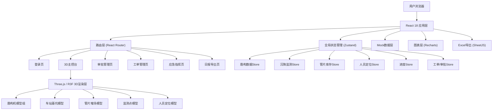

## 1. 架构设计



## 2. 技术说明

- **前端框架**: React@18 + TypeScript + Vite@5
- **3D渲染**: three@0.160 + @react-three/fiber@8 + @react-three/drei@9 + @react-three/postprocessing@2
- **样式方案**: TailwindCSS@3 + CSS Modules（局部组件样式）
- **状态管理**: Zustand@4（轻量级状态管理，避免Redux繁琐）
- **路由**: react-router-dom@6
- **图表库**: recharts@2（24小时参数曲线、沉降趋势图）
- **UI组件**: antd@5（日期选择、表格、弹窗、审批流程组件）
- **Excel导出**: xlsx@0.18 (SheetJS社区版)
- **动画库**: framer-motion@10（面板滑入/弹出、按钮微交互）
- **Mock数据**: 前端内置JSON Mock + setInterval模拟实时数据更新
- **人脸识别**: 调用浏览器getUserMedia API模拟人脸识别（实际项目对接人脸SDK）

## 3. 路由定义

| 路由路径 | 页面名称 | 访问权限 | 说明 |
|----------|----------|----------|------|
| /login | 登录页 | 公开 | 人脸识别登录入口 |
| /dashboard | 3D主控台 | 施工员/项目经理/公司领导 | 3D场景与核心监控面板 |
| /approval | 管片审批管理 | 施工员/项目经理/物资部 | 采购计划三级审批流程 |
| /workorder | 设备维护工单 | 施工员/项目经理 | 盾构机保养工单管理 |
| /emergency | 应急指挥中心 | 项目经理/公司领导 | 应急事件启动与路径调度 |
| /export | 施工日报导出 | 公司领导/项目经理 | 按日期导出Excel日报 |

## 4. 全局Store数据模型

### 4.1 盾构机数据模型 (ShieldStore)

```typescript
interface ShieldMachine {
  id: string;
  name: string;
  code: string;
  position: { x: number; y: number; z: number };
  rotation: { x: number; y: number; z: number };
  thrustSpeed: number;      // 推进速度 mm/min
  cutterTorque: number;     // 刀盘扭矩 kN·m
  groutingPressure: number; // 注浆压力 bar
  totalRings: number;       // 累计掘进环数
  cutterRotationSpeed: number; // 刀盘转速 rpm
  status: 'normal' | 'warning' | 'maintenance';
  history24h: {
    time: string;
    thrustSpeed: number;
    cutterTorque: number;
    groutingPressure: number;
    rings: number;
  }[];
}
```

### 4.2 沉降监测模型 (SettlementStore)

```typescript
interface MonitoringPoint {
  id: string;
  code: string;
  position: { x: number; y: number; z: number };
  currentValue: number;  // 当前沉降值 mm
  threshold: number;     // 阈值 mm
  trend: number[];       // 最近10次记录
  areaColor: string;     // 区域显示颜色
  status: 'normal' | 'warning' | 'danger';
}
```

### 4.3 管片库存模型 (SegmentStore)

```typescript
interface Segment {
  id: string;
  spec: string;         // 规格，如 "φ6200×300×1200"
  ageDays: number;      // 龄期（天）
  quantity: number;     // 库存数量
  safeStock: number;    // 安全库存
  position: { row: number; col: number; layer: number };
  status: 'normal' | 'low' | 'critical';
}

interface PurchasePlan {
  id: string;
  segmentId: string;
  spec: string;
  quantity: number;
  createTime: string;
  status: 'draft' | 'level1' | 'level2' | 'approved' | 'rejected';
  approvals: {
    role: string;
    user: string;
    time?: string;
    opinion?: string;
    status: 'pending' | 'approved' | 'rejected';
  }[];
}
```

### 4.4 人员定位模型 (PersonnelStore)

```typescript
interface Worker {
  id: string;
  name: string;
  jobType: '盾构司机' | '注浆工' | '管片拼装工' | '测量员' | '安全员' | '电工';
  position: { x: number; y: number; z: number };
  area: '地面' | '基坑' | '盾构机内' | '密闭舱室';
  enterTime?: string;   // 进入密闭舱室时间
  status: 'normal' | 'overtime';
}
```

### 4.5 车站进度模型 (ProgressStore)

```typescript
interface StationNode {
  id: string;
  name: string;
  plannedStart: string;
  plannedEnd: string;
  actualStart?: string;
  actualEnd?: string;
  progress: number;     // 百分比 0-100
  isKeyNode: boolean;
  status: 'pending' | 'inProgress' | 'completed' | 'delayed';
  suggestion?: string;  // 延期调整建议
}
```

### 4.6 工单与审批模型 (WorkOrderStore)

```typescript
interface MaintenanceOrder {
  id: string;
  shieldId: string;
  shieldName: string;
  type: '300环保养' | '500环保养' | '1000环大修';
  triggerRings: number;
  createTime: string;
  status: 'pending' | 'inProgress' | 'completed';
  items: string[];
  handler?: string;
}

interface EventLog {
  id: string;
  time: string;
  type: '预警' | '审批' | '工单' | '应急' | '进度';
  level: 'info' | 'warning' | 'danger';
  content: string;
  operator?: string;
}
```

### 4.7 应急模型 (EmergencyStore)

```typescript
interface EmergencyEvent {
  id: string;
  type: '涌水' | '坍塌' | '火灾' | '有害气体';
  position: { x: number; y: number; z: number };
  startTime: string;
  status: 'active' | 'resolved';
  evacuatePath: { x: number; y: number; z: number }[];
  rescuePath: { x: number; y: number; z: number }[];
  affectedPersonnel: string[];
}

interface UserAccount {
  id: string;
  username: string;
  password: string;
  role: 'worker' | 'manager' | 'director';
  faceData: string;  // 人脸特征数据（mock）
  lastLogin?: string;
}
```

## 5. 3D场景组件结构

```
SceneContainer (根容器)
├── Lights (光照组)
│   ├── 环境光
│   ├── 方向光（主光源）
│   └── 点光源（盾构机/基坑补光）
├── GroundPlane (地面/隧道地层)
├── StationPit (车站基坑组)
│   ├── 基坑围护结构
│   ├── 分层开挖面
│   ├── 支撑梁
│   └── 结构完成层（根据进度着色）
├── TunnelGroup (隧道组)
│   ├── 左线隧道管片环
│   └── 右线隧道管片环
├── ShieldMachineGroup (盾构机组)
│   ├── 1号盾构机
│   │   ├── 刀盘（带动画旋转）
│   │   ├── 盾壳
│   │   ├── 螺旋输送机
│   │   └── 操作舱（可点击高亮）
│   └── 2号盾构机
├── SegmentYard (管片堆场)
│   └── 管片堆叠阵列（按规格着色）
├── MonitoringPoints (监测点组)
│   └── 监测点球体（按状态切换绿/橙/红）
├── PersonnelGroup (人员模型组)
│   └── 人员简化模型+头顶标签
├── ControlCenter (监控中心建筑)
├── EmergencyPaths (应急路径)
│   ├── 绿色疏散路径（虚线+流动材质）
│   └── 蓝色救援路径（脉冲材质）
└── PostProcessing (后期处理)
    ├── Bloom 泛光
    └── Vignette 暗角
```

## 6. Mock数据更新机制

- 使用 `setInterval` 每 2000ms 更新盾构机实时参数（随机小幅波动）
- 每 10000ms 模拟一次沉降监测数据采集
- 每 30000ms 触发一次随机预警事件（用于演示）
- 人员定位每 5000ms 更新一次位置
- 施工进度每日模拟累加（根据日期计算）
